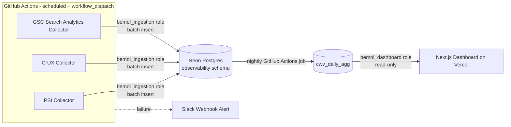

# Bemol Web Observability Platform — Architecture & Planning

## 1. Overview & Objective

This platform provides observability for [www.bemol.com.br](https://www.bemol.com.br) covering:

- **Core Web Vitals** (LCP, INP, CLS, FCP, TTFB) at scale — tens of thousands of URLs.
- **Technical SEO** health over time (indexation, crawl anomalies, redirects, canonicals, structured data, sitemaps).
- **Search Console** performance data (Clicks, Impressions, CTR, Average Position).
- Automated **regression detection**, dashboards, and alerts, supporting root-cause investigations (e.g. "why did CLS spike on category pages in August").

It is built as a production-grade system following Clean Architecture, SOLID, DRY, KISS, and YAGNI, with all historical data persisted in a dedicated Postgres database (Neon) rather than being layered into a shared analytics platform.

> **Decision record — Databricks → Neon.** This project originally targeted Bemol's Azure-hosted Databricks lakehouse as the sole data layer (see git history / `HANDOFF.md` for the original design). That was abandoned because provisioning a Databricks service principal (OAuth M2M) requires workspace/account admin rights in Bemol's Databricks instance that weren't obtainable, and a fallback attempt to create a Supabase project under the Bemol corporate account failed at signup. The project was moved to a personal GitHub account, and **Neon** (serverless Postgres) was chosen over Supabase because the user had already hit Supabase's per-account project limit. Neon was also a better technical fit than Supabase for this specific app: it's plain Postgres with a serverless HTTP/WebSocket driver designed for exactly this shape of workload (Vercel serverless reads + a GitHub Actions write job), without the connection-pool-exhaustion problems a traditional `pg` TCP pool hits in serverless environments — and without paying for Supabase's Auth/Storage/Realtime layer this app doesn't use. The trade-off: Neon has no built-in REST API or Row Level Security layer, so access control is done the traditional way — dedicated least-privilege Postgres roles per consumer (see §6) — rather than an `anon`/`service_role` split.

## 2. Technology Stack

| Layer | Choice | Notes |
|---|---|---|
| Dashboard | Next.js (App Router) + TypeScript | Server Components for all data reads — no client-side fetching for dashboard pages |
| Visualization | Recharts | Time-series charts |
| Styling | Tailwind CSS | |
| Ingestion | Node.js + TypeScript, scheduled via **GitHub Actions** | Not a Vercel serverless function — PSI calls take 10–30s each, exceeding Vercel Hobby's 10s function cap and its daily-only Hobby Cron |
| Rate limiting | `p-queue` | Respects PSI limits (~240 req/min, 25,000 req/day with an API key) |
| Data layer | **Neon** (serverless Postgres, `observability` schema) | Sole data store — see §4 |
| Data access | `@neondatabase/serverless` (`Pool`), wrapped by `@bemol/db-client` | Works over HTTP/WebSocket — safe for both Vercel serverless functions and GitHub Actions without connection-pool exhaustion |
| Auth to the database | Dedicated Postgres roles per consumer, not shared credentials | See §6 |
| Deployment | Vercel (dashboard), GitHub Actions (ingestion, scheduled + `workflow_dispatch`) | |
| Secrets | GitHub Secrets / Vercel environment variables | |

## 3. Architecture Diagram



## 4. Data Model (Postgres, `observability` schema)

See `sql/ddl/001_schema.sql` and `002_tables.sql` for the executable DDL. Summary:

```
observability.pages
  page_id     TEXT (PK)
  url         TEXT NOT NULL
  label       TEXT             -- "Home", "PDP - Eletrônicos", "Checkout"
  category    TEXT

observability.cwv_runs         -- PSI (lab) + CrUX (field) data
  run_id             UUID (PK)
  page_id            TEXT REFERENCES pages(page_id)
  strategy           TEXT      -- 'mobile' | 'desktop'
  source             TEXT      -- 'lab' (PSI) | 'field' (CrUX)
  performance_score  DOUBLE PRECISION
  lcp_ms             DOUBLE PRECISION
  inp_ms             DOUBLE PRECISION
  cls                DOUBLE PRECISION
  fcp_ms             DOUBLE PRECISION
  ttfb_ms            DOUBLE PRECISION
  collected_at       TIMESTAMPTZ NOT NULL
  -- indexed on (page_id, collected_at DESC)

observability.gsc_cwv_daily     -- site-wide CWV status (see §5 constraint)
  snapshot_date   DATE
  device          TEXT         -- 'mobile' | 'desktop'
  status          TEXT         -- 'poor' | 'needs_improvement' | 'good'
  url_count       BIGINT
  -- PK (snapshot_date, device, status)

observability.cwv_daily_agg     -- GOLD LAYER, refreshed nightly by a scheduled job
  page_id             TEXT REFERENCES pages(page_id)
  date                DATE
  avg_performance     DOUBLE PRECISION
  avg_lcp_ms          DOUBLE PRECISION
  avg_inp_ms          DOUBLE PRECISION
  avg_cls             DOUBLE PRECISION
  trend_7d_delta      DOUBLE PRECISION
  trend_30d_delta     DOUBLE PRECISION
  -- PK (page_id, date)
```

**Why a gold layer:** even though Neon is normal low-latency Postgres (no cold-start comparable to a Databricks SQL Warehouse), pre-aggregating keeps the dashboard's queries cheap and simple as `cwv_runs` grows into the millions of rows at full URL-catalog scale, and keeps trend calculations (7/30-day deltas) out of request-time code. The dashboard should query `cwv_daily_agg`, not raw `cwv_runs`.

**Refreshing the gold layer:** there is no Databricks-Job equivalent on Neon. Refresh `cwv_daily_agg` with a scheduled GitHub Actions job (a small script running the aggregation `INSERT ... SELECT` against Neon) — see Phase 3 in §11. Neon's free tier does not support the `pg_cron` extension, so an external scheduler is required either way.

**Neon cold start note:** on Neon's free tier, a compute instance suspends after a period of inactivity and takes roughly ~500ms–1s to resume on the next query. This is far smaller than a Databricks SQL Warehouse cold start, but still worth knowing about for the first request after an idle period (e.g. the first dashboard visit of the day).

## 5. Known Constraint — GSC Core Web Vitals Report Has No Public API

The CWV report as seen in the Search Console UI (Poor/Needs Improvement/Good bucket counts, per-URL diagnostics) **has no public REST API**. `searchanalytics.query` only returns Clicks/Impressions/CTR/Position — never assume or implement a `searchconsole.coreWebVitals` endpoint.

| # | Option | Fit |
|---|---|---|
| 1 | GSC Bulk Data Export → BigQuery | Closest to the UI report, but lands in BigQuery, not our Postgres database. Requires a small scheduled job to copy the relevant BigQuery tables into Neon (no native BigQuery↔Postgres federation exists, unlike the Databricks connector considered in the original design). |
| 2 | **CrUX API** (per URL/origin, free, ~28-day rolling) | ✅ **Chosen for now** — already covered by the `cwv_runs` ingestion path (§4). Good for per-URL monitoring, not site-wide bucket counts. |
| 3 | CrUX on BigQuery (public dataset, monthly histograms) | Same copy-job path as option 1; richer than the API but same BigQuery dependency. |
| 4 | Manual/scheduled CSV export from GSC UI | Not automatable via API — stopgap only, not a permanent pipeline. |

**Decision:** Start with **option 2 (CrUX API)** for per-URL field data as part of the standard `cwv_runs` ingestion. Option 1 (Bulk Export → BigQuery → Postgres copy job) is the target for true site-wide bucket counts (populating `gsc_cwv_daily`), but is **deferred pending confirmation of an open question** (§12): whether Bemol's GA4/GSC setup already exports to BigQuery, and whether this personal-account project would even retain access to that export. If it does, pulling data forward should be revisited; if not, a net-new BigQuery export must be provisioned first — a bigger lift and, given the account migration, possibly out of scope entirely.

## 6. Authentication & Security

- **Database (Neon)**: two dedicated Postgres roles, each with its own connection string/password (see `sql/ddl/003_roles.sql`):
  - `bemol_ingestion` — `SELECT` + `INSERT` on `observability.*`. Used only by the GitHub Actions ingestion workflow.
  - `bemol_dashboard` — `SELECT` only on `observability.*`. Used only by the Vercel-deployed dashboard.
  - Connection strings use Neon's **pooled** endpoint (`-pooler` host) to stay serverless-friendly.
- **Google Search Console**: service account (already provisioned) with Search Analytics read access.
- **PageSpeed Insights / Chrome UX Report**: a single Google API key (see `.env.example`), intended to be restricted in GCP to both APIs. As of this writing only the PageSpeed Insights API restriction is in place — the Chrome UX Report API is not yet enabled on the key, so CrUX collection currently fails with `403 API_KEY_SERVICE_BLOCKED` (see `HANDOFF.md`).
- **Secrets**: GitHub Secrets (ingestion workflow), Vercel environment variables (dashboard). Never hardcoded, never committed — `sql/ddl/003_roles.sql` uses a placeholder password that must be replaced before running.
- Validate and sanitize all external inputs (API responses, URLs) before processing or storing.

## 7. Observability Features

**Core Web Vitals** — current values, historical trends, threshold-based status:

| Metric | Good | Needs Improvement | Poor |
|---|---|---|---|
| LCP | ≤ 2.5s | 2.5s–4s | > 4s |
| INP | ≤ 200ms | 200ms–500ms | > 500ms |
| CLS | ≤ 0.1 | 0.1–0.25 | > 0.25 |

**Regression detection**: compare rolling 7-day average against the prior 7-day window per page/strategy; flag when a metric crosses a threshold band.

**Technical SEO monitoring**: indexation coverage, crawl anomalies, redirect chains, 404s, canonical tags, meta robots, structured data, sitemap health, internal linking issues.

**Search Console (Search Analytics only)**: service-account auth, Pages/Queries/Country/Device reports, stored alongside CWV data in Neon for correlation.

**PageSpeed Insights**: mobile + desktop scores, full Lighthouse metrics, opportunities, diagnostics, historical snapshots per URL/strategy.

## 8. CI/CD (GitHub Actions)

- **Pull requests**: install deps, lint, unit tests, build validation, security checks.
- **Main branch**: full validation pipeline, production build verification, deployment validation.
- **Scheduled ingestion workflow** (separate from app CI): runs PSI/CrUX/GSC collectors, writes to Neon. Ingestion **failures alert via Slack webhook** — never fail silently. Pipeline failures on the app CI block merges.

## 9. Testing Strategy

- Vitest + React Testing Library, minimum 80% coverage on components, hooks, services, utilities, API integrations.
- Integration tests covering database failure modes: connection errors, constraint violations, empty result sets.
- ESLint + Prettier, zero linting errors as a CI gate.

## 10. Performance & Scalability Considerations

- Batch inserts from ingestion (single multi-row `INSERT`, never row-by-row writes).
- Dashboard reads exclusively from the pre-aggregated gold table (`cwv_daily_agg`).
- `p-queue` rate limiting to respect PSI's ~240 req/min / 25,000 req/day ceiling when scaling to tens of thousands of URLs (implies sampling/rotation strategy at full scale — see Phase 6).
- Ingestion runs on GitHub Actions rather than Vercel functions because PSI calls (10–30s) exceed Vercel Hobby's 10s timeout, and Hobby Cron only fires once/day.
- Watch Neon's free-tier storage cap (0.5 GB) against `cwv_runs` growth once the URL catalog scales to tens of thousands of pages × 2 strategies × 2 sources per collection run — this may force a paid Neon tier well before Phase 6, unlike the original Databricks design which had no comparable ceiling.

## 11. Implementation Roadmap

| Phase | Scope |
|---|---|
| **1 — Foundations & provisioning** | Git init + repo scaffolding (monorepo: dashboard app + ingestion package); Neon project + `observability` schema/tables/roles; provision PSI/CrUX API key; CI skeleton (lint/test/build on PR) — ✅ done and verified against the live Neon project |
| **2 — Ingestion MVP** | `@bemol/db-client` wrapper around `@neondatabase/serverless`; PSI collector for a small seed URL list; CrUX collector; GitHub Actions scheduled workflow + `workflow_dispatch`; Slack failure alerting — ✅ PSI verified end-to-end against real Neon (homepage data collected and inserted); CrUX collector is implemented but blocked until the Chrome UX Report API is enabled in GCP (§6) |
| **3 — Gold layer & dashboard MVP** | Scheduled GitHub Actions job computing `cwv_daily_agg`; Next.js dashboard (Server Components, read-only) rendering current CWV + trends with Recharts; deploy to Vercel — not started |
| **4 — GSC Search Analytics integration** | Service-account auth; `searchanalytics.query` ingestion (Pages/Queries/Country/Device); correlation views joining CWV and Search Analytics data |
| **5 — Regression detection & alerting** | 7-day rolling comparison job; threshold-based alerts; surface alerts in the dashboard |
| **6 — Technical SEO monitoring & scale-out** | Indexation/crawl/redirect/canonical/sitemap checks; scale ingestion to the full tens-of-thousands-of-URL catalog (revisit PSI rate-limit strategy and Neon storage tier); revisit the GSC Bulk Export → BigQuery decision once the open question in §12 is resolved |

## 12. Open Questions / Assumptions

- **Does Bemol's GA4/GSC setup already export to BigQuery, and would this personal-account project retain access to it post-migration?** Determines whether GSC Bulk Data Export (§5, option 1) is realistic at all now.
- What is the source and size of the full URL catalog (tens of thousands of URLs) — sitemap crawl, CMS export, or another system of record?
- Which Slack channel/webhook should receive ingestion failure alerts?
- At what URL-catalog scale does Neon's free tier stop being viable, and is upgrading to a paid Neon plan in scope?
