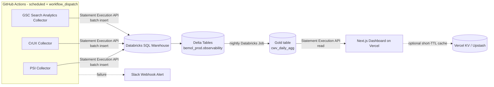

# Bemol Web Observability Platform — Architecture & Planning

## 1. Overview & Objective

This platform provides observability for [www.bemol.com.br](https://www.bemol.com.br) covering:

- **Core Web Vitals** (LCP, INP, CLS, FCP, TTFB) at scale — tens of thousands of URLs.
- **Technical SEO** health over time (indexation, crawl anomalies, redirects, canonicals, structured data, sitemaps).
- **Search Console** performance data (Clicks, Impressions, CTR, Average Position).
- Automated **regression detection**, dashboards, and alerts, supporting root-cause investigations (e.g. "why did CLS spike on category pages in August").

It is built as a production-grade system following Clean Architecture, SOLID, DRY, KISS, and YAGNI, with all historical data persisted in Bemol's existing Databricks lakehouse rather than a new operational database.

## 2. Technology Stack

| Layer | Choice | Notes |
|---|---|---|
| Dashboard | Next.js (App Router) + TypeScript | Server Components for all data reads — no client-side fetching for dashboard pages |
| Visualization | Recharts | Time-series charts |
| Styling | Tailwind CSS | |
| Ingestion | Node.js + TypeScript, scheduled via **GitHub Actions** | Not a Vercel serverless function — PSI calls take 10–30s each, exceeding Vercel Hobby's 10s function cap and its daily-only Hobby Cron |
| Rate limiting | `p-queue` | Respects PSI limits (~240 req/min, 25,000 req/day with an API key) |
| Data layer | **Databricks** (Delta tables, Unity Catalog schema `bemol_prod.observability`) | Sole data store — see §4, §10 |
| Data access | **Databricks SQL Statement Execution API** (`POST /api/2.0/sql/statements`) | Stateless HTTPS calls from both ingestion (write) and dashboard (read); no persistent JDBC/ODBC connections to manage |
| Auth to Databricks | Service principal, OAuth M2M | Never a personal access token in CI or shared contexts |
| Deployment | Vercel (dashboard), GitHub Actions (ingestion, scheduled + `workflow_dispatch`) | |
| Secrets | GitHub Secrets / Vercel environment variables | |

**Explicitly out of scope:** Postgres, Neon, Supabase, or any other OLTP database. This supersedes any earlier draft of the plan that assumed a traditional operational database — Databricks is the only persistence layer.

## 3. Architecture Diagram



## 4. Data Model (Delta tables, Unity Catalog)

```
bemol_prod.observability.pages
  page_id       STRING (PK)
  url           STRING
  label         STRING        -- "Home", "PDP - Eletrônicos", "Checkout"
  category      STRING

bemol_prod.observability.cwv_runs        -- PSI (lab) + CrUX (field) data
  run_id            STRING
  page_id           STRING
  strategy          STRING    -- 'mobile' | 'desktop'
  source            STRING    -- 'lab' (PSI) | 'field' (CrUX)
  performance_score DOUBLE
  lcp_ms            DOUBLE
  inp_ms            DOUBLE
  cls               DOUBLE
  fcp_ms            DOUBLE
  ttfb_ms           DOUBLE
  collected_at      TIMESTAMP
  -- partitioned by date(collected_at)

bemol_prod.observability.gsc_cwv_daily   -- site-wide CWV status (see §5 constraint)
  snapshot_date   DATE
  device          STRING      -- 'mobile' | 'desktop'
  status          STRING      -- 'poor' | 'needs_improvement' | 'good'
  url_count       BIGINT

bemol_prod.observability.cwv_daily_agg   -- GOLD LAYER, refreshed nightly by a Databricks Job
  page_id             STRING
  date                DATE
  avg_performance     DOUBLE
  avg_lcp_ms          DOUBLE
  avg_inp_ms          DOUBLE
  avg_cls             DOUBLE
  trend_7d_delta      DOUBLE
  trend_30d_delta     DOUBLE
```

**Why a gold layer:** a Databricks SQL Warehouse has cold-start and per-query latency (hundreds of ms to a few seconds) that a raw Postgres read wouldn't have. The dashboard must query `cwv_daily_agg`, never raw `cwv_runs`, to keep Statement Execution API calls fast and cheap.

## 5. Known Constraint — GSC Core Web Vitals Report Has No Public API

The CWV report as seen in the Search Console UI (Poor/Needs Improvement/Good bucket counts, per-URL diagnostics) **has no public REST API**. `searchanalytics.query` only returns Clicks/Impressions/CTR/Position — never assume or implement a `searchconsole.coreWebVitals` endpoint.

| # | Option | Fit |
|---|---|---|
| 1 | GSC Bulk Data Export → BigQuery | Closest to the UI report, but lands in BigQuery, not Databricks. Requires federating BigQuery into Databricks (native connector) or a copy job. |
| 2 | **CrUX API** (per URL/origin, free, ~28-day rolling) | ✅ **Chosen for now** — already covered by the `cwv_runs` ingestion path (§4). Good for per-URL monitoring, not site-wide bucket counts. |
| 3 | CrUX on BigQuery (public dataset, monthly histograms) | Same federation path as option 1; richer than the API but same BigQuery dependency. |
| 4 | Manual/scheduled CSV export from GSC UI | Not automatable via API — stopgap only, not a permanent pipeline. |

**Decision:** Start with **option 2 (CrUX API)** for per-URL field data as part of the standard `cwv_runs` ingestion. Option 1 (Bulk Export → BigQuery → Databricks federation) is the target for true site-wide bucket counts (populating `gsc_cwv_daily`), but is **deferred pending confirmation of an open question** (§12): whether Bemol's GA4/GSC setup already exports to BigQuery. If it does, federation should be pulled forward into the roadmap; if not, a net-new BigQuery export must be provisioned first, which is a bigger lift and a separate decision point with Bemol's data team.

## 6. Authentication & Security

- **Databricks**: OAuth M2M service principals. Dashboard principal gets `SELECT` only on `bemol_prod.observability.*`; ingestion principal gets `SELECT + MODIFY`. No personal access tokens in CI.
- **Google Search Console**: service account (already provisioned) with Search Analytics read access.
- **PageSpeed Insights**: API key (**not yet provisioned** — Phase 1 task).
- **Secrets**: GitHub Secrets (ingestion workflow), Vercel environment variables (dashboard). Never hardcoded.
- Validate and sanitize all external inputs (API responses, URLs) before processing or storing.

## 7. Observability Features

**Core Web Vitals** — current values, historical trends, threshold-based status:

| Metric | Good | Needs Improvement | Poor |
|---|---|---|---|
| LCP | ≤ 2.5s | 2.5s–4s | > 4s |
| INP | ≤ 200ms | 200ms–500ms | > 500ms |
| CLS | ≤ 0.1 | 0.1–0.25 | > 0.25 |

**Regression detection**: compare rolling 7-day average against the prior 7-day window per page/strategy; flag when a metric crosses a threshold band.

**Technical SEO monitoring**: indexation coverage, crawl anomalies, redirect chains, 404s, canonical tags, meta robots, structured data, sitemap health, internal linking issues.

**Search Console (Search Analytics only)**: service-account auth, Pages/Queries/Country/Device reports, stored alongside CWV data in Databricks for correlation.

**PageSpeed Insights**: mobile + desktop scores, full Lighthouse metrics, opportunities, diagnostics, historical snapshots per URL/strategy.

## 8. CI/CD (GitHub Actions)

- **Pull requests**: install deps, lint, unit tests, build validation, security checks.
- **Main branch**: full validation pipeline, production build verification, deployment validation.
- **Scheduled ingestion workflow** (separate from app CI): runs PSI/CrUX/GSC collectors, writes to Databricks. Ingestion **failures alert via Slack webhook** — never fail silently. Pipeline failures on the app CI block merges.

## 9. Testing Strategy

- Vitest + React Testing Library, minimum 80% coverage on components, hooks, services, utilities, API integrations.
- Integration tests covering Databricks Statement Execution API failure modes specifically: warehouse cold-start timeout, auth token expiry, malformed/partial result sets.
- ESLint + Prettier, zero linting errors as a CI gate.

## 10. Performance & Scalability Considerations

- Batch inserts from ingestion (never row-by-row writes) via the Statement Execution API.
- Dashboard reads exclusively from the pre-aggregated gold table (`cwv_daily_agg`).
- Optional short-TTL cache (Vercel KV/Upstash) in front of Databricks reads, since warehouse query latency is not comparable to an OLTP store.
- `p-queue` rate limiting to respect PSI's ~240 req/min / 25,000 req/day ceiling when scaling to tens of thousands of URLs (implies sampling/rotation strategy at full scale — see Phase 6).
- Ingestion runs on GitHub Actions rather than Vercel functions because PSI calls (10–30s) exceed Vercel Hobby's 10s timeout, and Hobby Cron only fires once/day.

## 11. Implementation Roadmap

| Phase | Scope |
|---|---|
| **1 — Foundations & provisioning** | Git init + repo scaffolding (monorepo: dashboard app + ingestion package); create Unity Catalog schema `bemol_prod.observability` and Delta table DDL; provision PSI API key; CI skeleton (lint/test/build on PR) |
| **2 — Ingestion MVP** | `DatabricksClient` wrapper around the Statement Execution API; PSI collector for a small seed URL list; CrUX collector; GitHub Actions scheduled workflow + `workflow_dispatch`; Slack failure alerting |
| **3 — Gold layer & dashboard MVP** | Nightly Databricks Job computing `cwv_daily_agg`; Next.js dashboard (Server Components, read-only) rendering current CWV + trends with Recharts; deploy to Vercel |
| **4 — GSC Search Analytics integration** | Service-account auth; `searchanalytics.query` ingestion (Pages/Queries/Country/Device); correlation views joining CWV and Search Analytics data |
| **5 — Regression detection & alerting** | 7-day rolling comparison job; threshold-based alerts; surface alerts in the dashboard |
| **6 — Technical SEO monitoring & scale-out** | Indexation/crawl/redirect/canonical/sitemap checks; scale ingestion to the full tens-of-thousands-of-URL catalog (revisit PSI rate-limit strategy); revisit the GSC Bulk Export → BigQuery federation decision once the open question in §12 is resolved |

## 12. Open Questions / Assumptions

- **Does Bemol's GA4/GSC setup already export to BigQuery?** Determines whether GSC Bulk Data Export federation (§5, option 1) can be pulled into an earlier phase or requires provisioning a net-new BigQuery export first.
- What is the source and size of the full URL catalog (tens of thousands of URLs) — sitemap crawl, CMS export, or another system of record?
- Which Slack channel/webhook should receive ingestion failure alerts?
- Monorepo (dashboard + ingestion in one repo) vs. two separate repos — assumed monorepo for Phase 1 pending confirmation.
