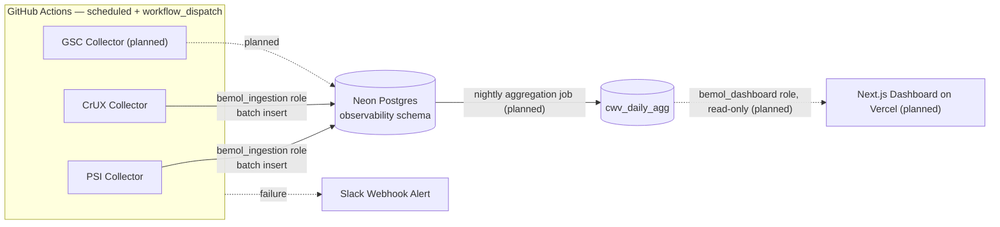
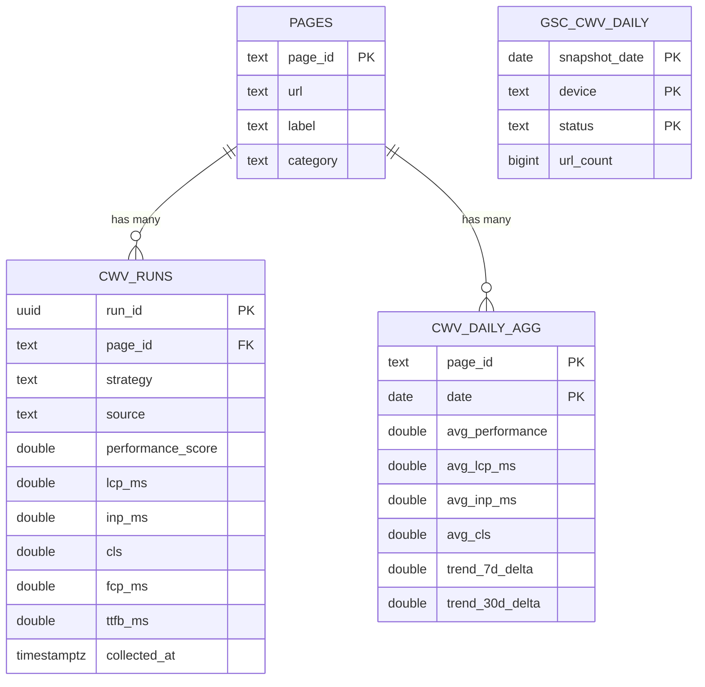
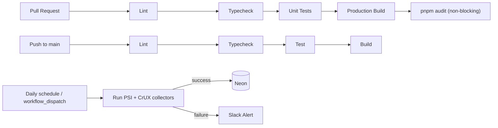

# Bemol Web Observability

A Core Web Vitals and technical SEO observability platform, built to monitor production e-commerce traffic at the scale of tens of thousands of URLs without relying on a shared analytics platform.

[](.nvmrc)
[](tsconfig.base.json)
[](pnpm-workspace.yaml)
[](LICENSE)

> **Status:** early-stage, actively developed. Phases 1–2 of the roadmap (below) are implemented and verified against a live database; Phases 3–6 are not yet built. This README states current capabilities plainly and marks planned work as planned — see [Roadmap](#roadmap).

---

## Table of Contents

- [Project Overview](#project-overview)
- [Architecture](#architecture)
- [Technology Stack](#technology-stack)
- [Engineering Practices](#engineering-practices)
- [Features](#features)
- [Project Structure](#project-structure)
- [Data Flow](#data-flow)
- [Installation](#installation)
- [Data Access Layer](#data-access-layer)
- [Database Design](#database-design)
- [Security](#security)
- [Testing Strategy](#testing-strategy)
- [Observability](#observability)
- [CI/CD Pipeline](#cicd-pipeline)
- [Infrastructure](#infrastructure)
- [Performance Considerations](#performance-considerations)
- [Technical Decisions](#technical-decisions)
- [Challenges and Lessons Learned](#challenges-and-lessons-learned)
- [Roadmap](#roadmap)
- [Contributing](#contributing)
- [License](#license)

---

## Project Overview

### Executive Summary

Bemol Web Observability collects Core Web Vitals (LCP, INP, CLS, FCP, TTFB) and, eventually, technical SEO signals for a large e-commerce site, persists them as time-series data in a dedicated Postgres database, and exposes them through a read-only dashboard for trend analysis and regression detection.

### Business Context

Large e-commerce catalogs (tens of thousands of product/category pages) degrade in performance and SEO health gradually and unevenly — a template change can silently push Cumulative Layout Shift over threshold on category pages while leaving the homepage untouched. Google Search Console's UI shows *that* this happened, days later, aggregated, with no way to correlate it against a deploy or a specific page template. Engineering teams need their own historical, queryable record of these metrics, not a UI report.

### Technical Context

Two constraints shaped every decision in this codebase:

1. **The Core Web Vitals report in the Search Console UI has no public API.** `searchanalytics.query` only returns Clicks/Impressions/CTR/Position. Field CWV data has to come from the CrUX API directly, per URL, and lab data from PageSpeed Insights — see [Technical Decisions](#technical-decisions).
2. **The platform originally targeted a shared corporate data lake (Databricks)**, which turned out to be operationally unreachable (see [Challenges and Lessons Learned](#challenges-and-lessons-learned)). The project now runs on infrastructure a single engineer can fully own and provision: Neon (serverless Postgres), Vercel, and GitHub Actions.

### Main Objectives

- Collect lab (PSI) and field (CrUX) Core Web Vitals per URL/strategy on a schedule, without manual intervention.
- Persist full history — not just current snapshots — to support trend and regression analysis.
- Keep the read path (dashboard) fast and cheap regardless of how large the write path (ingestion) grows.
- Stay operable by one engineer: no infrastructure that requires a platform team to provision or maintain.

### Key Benefits

- **Historical correlation.** Every collection run is a row, not an overwrite — "why did CLS spike in August" is a query, not an export.
- **API-quota-aware by design.** Ingestion is rate-limited against Google's actual PSI/CrUX quotas, not fired off in an unbounded loop.
- **No vendor lock to a analytics SaaS.** Data lives in plain Postgres; it can be queried, exported, or migrated with standard SQL tooling.

---

## Architecture

The system is a **modular monorepo** split along the read/write boundary: an ingestion service that only writes, and a dashboard that only reads. There is no shared runtime between them — they communicate exclusively through the database, each through its own least-privilege role.

Within each app, logic is separated into thin layers: **collectors** (external API clients, no persistence knowledge), **repositories** (SQL, no HTTP knowledge), and a **thin orchestration entrypoint** that wires them together. This isn't a full Clean/Hexagonal Architecture with a domain layer — the domain logic here is genuinely thin (fetch, map, insert) — but the same dependency direction applies: collectors and repositories don't know about each other, and both are swappable independently (proven in practice — the entire database layer was swapped from Databricks to Postgres without touching collector code; see [Technical Decisions](#technical-decisions)).



Solid arrows are implemented and verified against production data; dashed arrows are designed but not yet built (see [Roadmap](#roadmap)).

---

## Technology Stack

| Layer | Technology | Purpose |
|---|---|---|
| Language | TypeScript 5.7 (strict mode) | Type safety across every package in the monorepo |
| Frontend framework | Next.js 15 (App Router) | Dashboard shell; Server Components only — no client-side data fetching |
| Styling | Tailwind CSS | Utility-first styling for the dashboard |
| Charting | Recharts | Time-series CWV visualization (wired once Phase 3 lands) |
| Runtime | Node.js 22 | Ingestion collectors, scripts, CI |
| Database | Neon (serverless Postgres) | Sole persistence layer for CWV time-series data |
| DB driver | `@neondatabase/serverless` (HTTP query mode) | Stateless per-query `fetch` calls — no connection pool to exhaust from a serverless function or a CI runner |
| Rate limiting | `p-queue` | Client-side throttling against PSI's ~240 req/min / 25,000 req/day quota |
| Package management | pnpm workspaces | Monorepo dependency management, no build orchestrator (Turborepo) needed at this scale |
| Testing | Vitest | Unit tests for collectors, repositories, and the DB client |
| Linting | ESLint 9 (flat config) + `typescript-eslint` | Static analysis gate in CI |
| CI/CD | GitHub Actions | PR validation, main-branch checks, scheduled ingestion |
| Hosting (planned) | Vercel | Dashboard deployment, Phase 3 |
| External APIs | Google PageSpeed Insights, Chrome UX Report, Search Console (planned) | Lab + field Core Web Vitals and search performance data sources |

No message broker, cache layer, container orchestrator, or IaC tool is in use — the system's scale and single-writer/single-reader shape don't currently need one. See [Infrastructure](#infrastructure) for the honest reasoning.

---

## Engineering Practices

- **Single Responsibility, applied literally.** A collector never touches SQL; a repository never touches `fetch`. `cwvRunsRepository.ts` builds parameterized statements and nothing else.
- **DRY without premature abstraction.** `packages/types` is the one shared source of truth for the data shape, used by both apps — but no shared "framework" layer was built beyond what two consumers actually needed.
- **YAGNI, enforced by the migration history.** The original design used Databricks' Statement Execution API with OAuth token caching and statement polling. None of that complexity survived the move to Postgres — it was pure incidental complexity from the chosen backend, not the domain.
- **Twelve-Factor config.** All credentials and environment-specific values (`DATABASE_URL`, API keys, webhook URLs) come from environment variables, never from code; `.env.example` documents every variable a deployment needs.
- **CI as a gate, not a formality.** Every PR runs lint, typecheck, unit tests, and a production build before merge is possible (`.github/workflows/pr.yml`).
- **Conventional Commits.** Every commit follows `type(scope): subject` so the history itself is a changelog.

---

## Features

### Current

- [x] PSI (lab) collector — Lighthouse performance score, LCP, CLS, FCP, TTFB per URL/strategy
- [x] CrUX (field) collector — p75 real-user LCP, INP, CLS, FCP, TTFB per URL/strategy
- [x] Rate-limited collection via `p-queue`, safe under PSI's published quota
- [x] Parameterized batch inserts into Postgres (no string-built SQL)
- [x] Least-privilege database roles (`bemol_ingestion`: SELECT+INSERT, `bemol_dashboard`: SELECT-only)
- [x] Scheduled ingestion via GitHub Actions (`workflow_dispatch` + daily cron)
- [x] Slack alert on ingestion failure
- [x] Verified end-to-end against a live database with real production URL data

### Planned

- [ ] Nightly gold-layer aggregation (`cwv_daily_agg`) — 7/30-day trend deltas
- [ ] Dashboard read path (Server Components, Recharts trend visualization)
- [ ] Google Search Console Search Analytics ingestion (Pages/Queries/Country/Device)
- [ ] Threshold-based regression detection and alerting
- [ ] Technical SEO monitoring (indexation, redirects, canonicals, sitemap health)
- [ ] Full URL-catalog scale-out (tens of thousands of URLs)

### Future Roadmap

See [Roadmap](#roadmap) for the phased plan and [ARCHITECTURE.md](./ARCHITECTURE.md) for open questions that gate later phases (e.g. GSC Bulk Data Export feasibility).

---

## Project Structure

```text
bemol-web-observability/
├── apps/
│   ├── dashboard/              # Next.js App Router dashboard (Vercel) — scaffolded, no data reads yet
│   │   └── src/app/            # Route segments, Server Components only
│   └── ingestion/               # Node.js collectors, run by GitHub Actions
│       └── src/
│           ├── collectors/     # External API clients (PSI, CrUX) — no DB knowledge
│           ├── repositories/   # SQL against Neon — no HTTP knowledge
│           ├── config.ts       # Environment variable loading/validation
│           ├── seed.ts         # Applies sql/seed/*.sql via the same DB client
│           └── index.ts        # Orchestration entrypoint
├── packages/
│   ├── db-client/               # Wraps @neondatabase/serverless behind query()/execute()
│   └── types/                   # Shared TypeScript types mirroring the Postgres schema
├── sql/
│   ├── ddl/                     # Schema, tables, and least-privilege roles
│   └── seed/                    # Seed data (currently just the homepage)
└── .github/workflows/           # CI (pr, main) + scheduled ingestion
```

**Why this split:** `collectors` and `repositories` are each independently testable with a mocked `fetch` (see [Testing Strategy](#testing-strategy)), and independently replaceable — the repository layer was rewritten wholesale during the Neon migration while every collector test kept passing unmodified.

---

## Data Flow

For a single ingestion run (`apps/ingestion/src/index.ts`):

1. **Load configuration.** Validate `DATABASE_URL` and the Google API key are present; fail fast and loudly if not.
2. **Read the URL catalog.** `SELECT * FROM observability.pages` via the `bemol_ingestion` role.
3. **Collect, rate-limited.** For each page × strategy (mobile/desktop), queue a PSI call and a CrUX call through independent `p-queue` instances. A failure on one page/strategy is logged and does not abort the run.
4. **Batch insert.** All successfully collected runs are written in a single parameterized multi-row `INSERT` into `cwv_runs`.
5. **Report and exit.** Log the collected/inserted counts; exit non-zero if any collector errors occurred, so the GitHub Actions workflow's failure step fires the Slack alert.

---

## Installation

### Prerequisites

- Node.js 22 (see `.nvmrc`)
- pnpm 9 (`corepack enable` picks up the version pinned in `package.json`)
- A [Neon](https://neon.tech) account and project
- A Google Cloud project with the **PageSpeed Insights API** and **Chrome UX Report API** enabled, and an API key restricted to both

### Clone Repository

```bash
git clone https://github.com/fabricio-hunt/bemol-web-observability.git
cd bemol-web-observability
pnpm install
```

### Environment Variables

```bash
cp .env.example .env.local
```

```dotenv
# --- Database (Neon Postgres) ---
DATABASE_URL=postgresql://bemol_ingestion:<password>@<endpoint>-pooler.<region>.aws.neon.tech/<db>?sslmode=require
DASHBOARD_DATABASE_URL=postgresql://bemol_dashboard:<password>@<endpoint>-pooler.<region>.aws.neon.tech/<db>?sslmode=require

# --- Google APIs ---
PSI_API_KEY=

# --- Google Search Console (planned) ---
GSC_SERVICE_ACCOUNT_KEY=
GSC_SITE_URL=https://www.bemol.com.br/

# --- Alerting ---
SLACK_WEBHOOK_URL=
```

### Database Setup

```bash
# Run in order against your Neon database (SQL editor or psql)
sql/ddl/001_schema.sql
sql/ddl/002_tables.sql
sql/ddl/003_roles.sql   # replace both placeholder passwords first — see the file's header comment
```

```bash
pnpm --filter @bemol/ingestion seed
```

### Local Development

```bash
pnpm --filter @bemol/ingestion start   # run the collectors once, against real APIs and your Neon DB
pnpm --filter @bemol/dashboard dev     # run the dashboard (no data wired up yet)
```

### Docker Setup

Not applicable — there is no containerized runtime in this project. The ingestion job runs as a plain Node process on a GitHub Actions runner; the dashboard deploys to Vercel's managed Next.js runtime. Introducing Docker would add an abstraction layer neither deployment target needs.

### Production Deployment

- **Ingestion**: `.github/workflows/ingestion.yml`, scheduled daily + manually triggerable via `workflow_dispatch`. Secrets (`DATABASE_URL`, `PSI_API_KEY`, `SLACK_WEBHOOK_URL`) are configured under repository **Settings → Secrets and variables → Actions**.
- **Dashboard**: deploys to Vercel on push to `main` (once Phase 3 exists to deploy).

---

## Data Access Layer

This project has no public-facing REST/GraphQL API — it's a two-sided internal system (writer + reader) against one database, not a service other systems call into. The relevant "interface" is the one exposed by `@bemol/db-client`:

```ts
class DbClient {
  query<T>(sql: string, params?: unknown[]): Promise<T[]>;
  execute(sql: string, params?: unknown[]): Promise<void>;
  end(): Promise<void>;
}
```

Both the ingestion job and the (future) dashboard depend on this interface, not on `@neondatabase/serverless` directly — the same seam that made the Databricks → Neon migration a contained rewrite rather than a project-wide one.

---

## Database Design

### Entities



### Data Model Decisions

- **`cwv_runs` is append-only.** Every collection run is a new row, never an update — this is what makes historical trend analysis and regression root-causing possible at all.
- **`source` distinguishes lab from field data** (`'lab'` = PSI/Lighthouse, `'field'` = CrUX real-user data) in the same table, rather than two tables, because every downstream query (thresholds, trends) treats them identically except for provenance.
- **INP is `NULL` for lab runs, by design** — Lighthouse cannot measure a real user interaction in a lab run; only CrUX field data populates it. This is documented in code (`collectors/psi.ts`), not silently defaulted to zero.
- **`cwv_daily_agg` (gold layer, planned)** exists so the dashboard never queries raw `cwv_runs` directly — keeping dashboard reads cheap regardless of how many rows `cwv_runs` accumulates.

Full DDL: [`sql/ddl/`](./sql/ddl).

---

## Security

- **Least-privilege database access.** Two Postgres roles, not one shared credential: `bemol_ingestion` (SELECT + INSERT) for the write path, `bemol_dashboard` (SELECT only) for the read path. Neither role can do what it doesn't need to.
- **No secrets in source control.** All credentials live in GitHub Secrets or local `.env.local` (gitignored). `sql/ddl/003_roles.sql` ships with intentionally *invalid* (unquoted) password placeholders so the script fails loudly if run unmodified, rather than silently creating roles with a known password.
- **Input validation at the boundary.** External API responses (PSI, CrUX) are typed and defensively accessed (`?.`) rather than trusted as well-formed; malformed responses fail a single collection, not the whole run.
- **Known gap, stated plainly:** the dashboard (once built) will be a public Vercel deployment with no authentication layer of its own. Given the data isn't sensitive (public-page performance metrics), this is an accepted trade-off for now, not an oversight — but it means access control, if ever needed, is a Phase 3+ decision, not something already handled.
- **Secret rotation happened in practice, not just in theory:** during setup, role passwords were briefly committed as a valid (if placeholder) string; they were rotated via `ALTER ROLE ... WITH PASSWORD` the same session, and the DDL script was hardened afterward — see [Challenges and Lessons Learned](#challenges-and-lessons-learned).

---

## Testing Strategy

- **Unit tests only, currently.** Vitest, with `fetch` and the Neon driver mocked — no test hits a real network or database. 10 tests across `packages/db-client` and `apps/ingestion` as of this writing.
- **No integration or E2E tests yet.** Meaningful integration tests here would hit real PSI/CrUX/Neon endpoints, which isn't done in CI to avoid quota consumption and flakiness; this is a real gap, not an oversight, and is worth revisiting once the dashboard exists to test against.
- **No enforced coverage threshold yet.** The engineering standard for this project targets 80% on components/hooks/services/utilities, but coverage isn't currently measured or gated in CI — stated honestly rather than claimed as met.

```bash
pnpm test                                    # every package
pnpm --filter @bemol/db-client test          # a single package
pnpm --filter @bemol/ingestion test
```

---

## Observability

There's a real distinction worth naming: this platform *produces* observability data about an external website, but it does not yet have operational observability *of itself*.

- **Today:** `console.log`/`console.error` in the ingestion job, surfaced as GitHub Actions run logs; a single Slack webhook fires on ingestion failure.
- **Not implemented:** structured logging, metrics, tracing, or a dashboard for the platform's own health (ingestion latency, API error rates, quota consumption over time). No Grafana, Prometheus, OpenTelemetry, or APM vendor is in use — introducing one before there's a second engineer or a paging rotation to justify it would be over-engineering for the current scale.

---

## CI/CD Pipeline



Three independent workflows (`.github/workflows/`):

- **`pr.yml`** — lint, typecheck, unit tests, production build, non-blocking `pnpm audit`. Required to merge.
- **`main.yml`** — the same validation pipeline against `main`, as a guard on what Vercel is about to deploy.
- **`ingestion.yml`** — the actual data pipeline. Separate from app CI on purpose: its failure mode is "the data collection didn't run," which should page via Slack, not block a merge.

---

## Infrastructure

| Concern | Choice | Why |
|---|---|---|
| Compute (ingestion) | GitHub Actions runner | PSI calls take 10–30s each; exceeds Vercel Hobby's 10s function timeout, and Hobby Cron only fires once/day |
| Compute (dashboard) | Vercel (planned) | Native Next.js hosting, zero-config deploys from `main` |
| Database | Neon (serverless Postgres) | See [Technical Decisions](#technical-decisions) |
| Secrets | GitHub Secrets, Vercel env vars | No secrets manager introduced — team size and secret count don't justify one yet |
| IaC | **None** | The entire infrastructure footprint is two managed SaaS platforms (Neon, Vercel) and GitHub Actions YAML, all configured through their own consoles/APIs. Terraform/Pulumi would formalize state for infrastructure that's currently three resources — premature at this scale, revisit if that changes |

No AWS/Azure/GCP compute is provisioned. Google Cloud is used **only** for API keys (PageSpeed Insights, Chrome UX Report, Search Console) — there is no GCP compute, storage, or IAM footprint beyond that.

---

## Performance Considerations

- **Batch inserts, not row-by-row.** A single parameterized multi-row `INSERT` per run, regardless of how many pages/strategies were collected.
- **Gold-layer read pattern (planned).** The dashboard is designed to never query raw `cwv_runs` — only the pre-aggregated `cwv_daily_agg` — so dashboard latency stays flat as history accumulates.
- **Client-side rate limiting.** `p-queue` caps concurrent PSI/CrUX calls well under Google's published quotas; this was a deliberate design choice, not a reaction to being rate-limited in practice.
- **Cost ceiling, stated explicitly:** Neon's free tier caps storage at 0.5 GB. At full catalog scale (tens of thousands of URLs × 2 strategies × 2 sources per run) this is a real constraint that will likely force a paid tier before the platform reaches Phase 6 — tracked in [ARCHITECTURE.md](./ARCHITECTURE.md), not discovered by surprise later.

---

## Technical Decisions

**Why Neon instead of Databricks (the original design).** The platform was originally scoped against a corporate Databricks lakehouse (Unity Catalog, OAuth M2M service principals). That required Databricks workspace/account admin rights that weren't obtainable in practice — none of the four required credentials were ever issued. Neon was chosen as the replacement because it needed no organizational provisioning step at all: a personal account, a SQL editor, and a connection string.

**Why Neon instead of Supabase.** Supabase was tried twice — once blocked by corporate email policy at signup, once blocked by a personal-account project limit. Neon has no equivalent per-account project cap, and technically fits this workload better anyway: it's plain Postgres with an HTTP query driver, without an Auth/Storage/Realtime layer this project never needed.

**Why the HTTP driver (`neon()`) instead of `Pool`.** `@neondatabase/serverless`'s `Pool` class depends on a WebSocket implementation that isn't wired up by default in plain Node.js — it failed outright in local testing ("All attempts to open a WebSocket... fetch failed"). The HTTP query function needs no such configuration and matches this client's actual usage pattern: a handful of independent queries per invocation, never a multi-statement transaction.

**Why GitHub Actions instead of Vercel Cron for ingestion.** PSI calls take 10–30 seconds each; Vercel's Hobby tier caps serverless functions at 10 seconds and only fires Cron once a day. GitHub Actions has neither limit and is already the CI runner for this repo.

**Why parameterized `$n` SQL instead of an ORM.** The query surface is small (two tables written to, a handful of read patterns) and the exact SQL matters for the batch-insert performance characteristic described above. An ORM would add an abstraction layer this project doesn't need yet.

---

## Challenges and Lessons Learned

- **A "simple" data-layer decision took three platform changes to land.** Databricks → Supabase (corporate) → Supabase (personal) → Neon, each blocked by a different access constraint rather than a technical one. The lesson generalized into this repo: `HANDOFF.md` documents the full trail so the reasoning isn't lost, and `ARCHITECTURE.md` §1 carries a permanent decision record instead of pretending the first design was the only one considered.
- **A secret was briefly committed, and the fix became a permanent guardrail.** `sql/ddl/003_roles.sql`'s original placeholder passwords were syntactically valid strings — someone could run the script unmodified and get roles with a known password (which happened, once, safely, and was rotated immediately). The fix wasn't just rotating the password; it was changing the placeholder to unquoted, syntactically invalid SQL, so the same mistake now fails loudly instead of succeeding silently.
- **The "serverless" driver still needed a runtime-specific choice.** Choosing a Postgres driver from Neon's own SDK wasn't the end of the decision — `Pool` vs. the HTTP `neon()` function mattered, and only testing against a real database (not a mock) surfaced it.

---

## Roadmap

### v1.0 — Ingestion Foundation *(current)*

- [x] Monorepo scaffold, CI, least-privilege database roles
- [x] PSI + CrUX collectors, verified against production data
- [ ] Chrome UX Report API fully enabled (currently blocked by a pending GCP configuration step)

### v2.0 — Dashboard & Correlation

- [ ] Gold-layer nightly aggregation job
- [ ] Next.js dashboard: current values, historical trends, Recharts visualization
- [ ] Google Search Console Search Analytics ingestion and correlation views
- [ ] Threshold-based regression detection (rolling 7-day comparison) and alerting

### v3.0 — Scale & SEO

- [ ] Technical SEO monitoring (indexation, redirects, canonicals, sitemap health)
- [ ] Full URL-catalog ingestion (tens of thousands of URLs) with revisited rate-limit/cost strategy
- [ ] Revisit GSC Bulk Data Export → BigQuery feasibility (see `ARCHITECTURE.md` §5, §12)

---

## Contributing

This is a closed, internal Bemol project. It does not accept external contributions, issues, or pull requests. Internal changes follow the same CI gate as any branch: `pnpm lint && pnpm typecheck && pnpm test && pnpm build` must pass before merge.

---

## License

Proprietary and confidential — © Bemol S.A. All rights reserved. See [`LICENSE`](./LICENSE). No permission is granted to use, copy, modify, or distribute this software outside of Bemol S.A.
